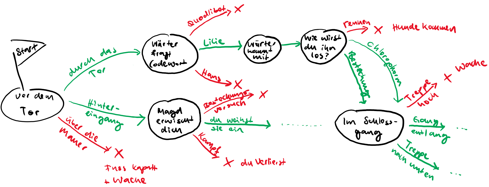

# Auftrag Textadventure-Game

Schon auf den allerersten Computern entstanden Computerspiele. Da diese Computer oft noch über keinerlei grafische Fähigkeiten verfügten, war man auf das Einlesen und Ausgeben von Text beschränkt. Diese Limitierungen haben jedoch der Kreativität keinen Abbruch getan, und es entstanden viele faszinierende Spiele auf Textbasis. Zum Beispiel das Spiel [Hamurabi](https://en.wikipedia.org/wiki/Hamurabi_(video_game)) aus dem Jahr 1968.

Jetzt aber zu unserem Spiel. Bevor du Starten kannst, brauchst du einen Plan wie dein Game funktionieren soll.

1. Bestimme, an welchem Ort und in welcher Zeit deine Geschichte sich abspielt.
2. Überlege dir, in welche Rolle die Spielerin schlüpft.
3. Was sind die verschiedenen Stationen der Geschichte? Skizzieren den Ablauf der Geschichte mit maximal _zehn_ Stationen, in welchen die Spielerin einen Entscheid fällen muss.

Eine mögliche Skizze des Games könnte beispilsweise so aussehen:

... und das Spiel dann so:

> Wilkommen im Schlossgarten zu Hininghausen.
>
> Als Robin Hood deiner Zeit bist zu gekommen, um den Schatz des grausamen Herrschers zu stehlen, und ihn unter dem Volk zu verteilen.
>
> Du stehst vor dem Eingang hinter einem Baum, und überlegst dir, wie du an den Wachen beim Tor vorbei kommen könntest.
>
> Was tust du?
>
> A) Du gehst ganz normal durch das Eingangstor, und gibst bei den Wachen an, dass du gerufen wurdest, um die Stühle im Schlosssaal des Herrschers zu reparieren.
>
> B) Du kletterst in sicherem Abstand zum Tor über die drei Meter hohe Mauer.
>
> C) Du schleichst dich beim Bediensteteneingang auf der Hinterseite hinein.
>
> \> __B__
>
> Du brichst dir beim Sprung von der Mauer den Fuss, und landest zudem direkt vor einer Wache. Autsch!
> Du wirst festgenommen und in den Kerker geworfen.
>
>  ---- GAME OVER ---

Tipps:
* Mit der Funktion `exit()` kannst du das Programm beenden.
* Mit der Funktion `random.randint()`, welche du schon beim Beispiel mit dem Grosi gesehen hast, kannst du im Spiel auch den Zufall spielen lassen. Zum Beispiel, ob man einen Kampf gewinnt oder nicht.
* Auch mit nur Text lassen sich Grafiken basteln. Beispiele findest du ganz viele im Web, wenn du zum Beispiel nach dem Begriff "_asciiart_" suchst. Du kannst auch grossen Text in speziellen Schriftarten generieren: http://patorjk.com/software/taag/#p=display&f=Slant&t=GymNeufeld
